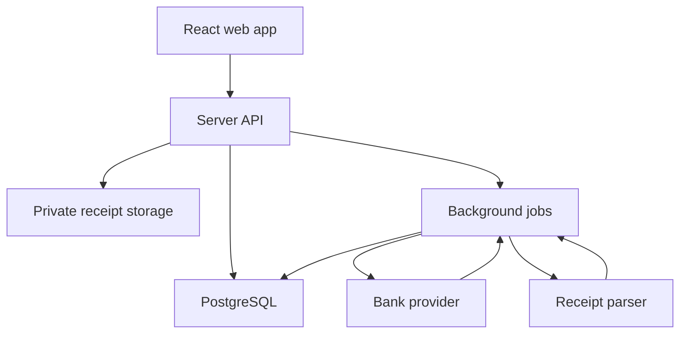

# Finance Tracker — Technical Requirements

**Status:** Proposed implementation plan  
**Updated:** September 29, 2026  
**Companion:** `finance-tracker-ui-requirements.md`

## 1. Decisions and constraints

| Decision | Requirement |
| --- | --- |
| Audience | Portfolio demo with seeded, fictional data; separate private use with the owner's real accounts and invited roommates. |
| Clients | React/TypeScript responsive web application for desktop and phone. Treat an installable web app as an enhancement, not a prerequisite for core functions. |
| Banking | Automatic syncing is important for private use. Evaluate Plaid for Chase, Discover, and Vanguard; verify institution/product coverage and production eligibility before committing. Apple Card automatic sync is deferred. |
| Receipts | Prioritize accurate line-item extraction with human correction, item-level categories, transaction matching, and item-level roommate splits. |
| Automation | Suggestions require review. Permanent categorization rules require explicit user approval. |
| Privacy | Personal financial records belong to one user; households only receive explicitly shared expense records and allowed receipt details. |

## 2. Proposed architecture

Start with one TypeScript web repository and a modular server. Avoid separate microservices for the portfolio version.

| Layer | Initial choice | Responsibility |
| --- | --- | --- |
| Web client | React + TypeScript, with Next.js as a practical full-stack option | Responsive pages, authenticated sessions, upload/review flows, charts, and household UI. |
| API and jobs | Server-side TypeScript modules; background job runner for sync and receipt work | Validate requests, enforce ownership, connect providers, process webhooks, and run idempotent jobs. |
| Database | PostgreSQL | Users, accounts, transactions, receipts, items, categories, rules, households, shares, settlements, and audit events. |
| Auth and storage | Supabase Auth and private object storage are a practical option | User login, invitations, protected receipt files, and signed download URLs. Enforce database row-level security as a second boundary. |
| Bank adapter | Plaid initially | Institution linking, transaction changes, connection health, and optional investment holdings. Keep provider identifiers behind an adapter. |
| Receipt adapter | Evaluate Amazon Textract AnalyzeExpense first | Extract header and line-item fields; retain raw output and confidence for review. |
| Categorization | Deterministic rules + item classifier | Suggest categories with evidence, confidence, and a review status; never equate merchant with all items bought there. |

Logical flow:

The public demo must use a **separate dataset and environment** from private live data. A demo user must never see real records, filenames, provider errors, or account metadata. Seed the demo with realistic fictional transactions and several receipts that exercise mixed categories and roommate splits.

## 3. Data model

Use UUID primary keys and timestamps. Store money in integer minor units (for USD, cents), with currency codes; avoid floating-point calculations for balances and splits.

| Entity | Key fields and relationships |
| --- | --- |
| `user_profile` | `user_id`, display name, preferences. Auth identity is the source of truth. |
| `connection` | Owner, provider, institution, encrypted provider token reference, sync cursor, status, last sync, consent/error state. Never expose tokens to clients. |
| `account` | Owner, connection, provider account ID, type/subtype, display name, masked identifier, current balance and balance timestamp when available. |
| `transaction` | Owner, account, provider transaction ID or import fingerprint, posted/pending state, date, amount, merchant/description, transfer/refund flags, source, review status. |
| `receipt` | Owner, private file key, parse status, merchant/date/total, extracted raw data reference, confirmed fields, optionally linked transaction ID. |
| `receipt_item` | Receipt, source text, normalized name, quantity, item subtotal, discount, tax/tip allocation, confidence, review state. |
| `category` | System category or user-owned custom category, parent category, display properties. |
| `allocation` | Transaction or receipt item, category, amount in cents, provenance (suggested/manual/rule), approval state. Final allocations must reconcile to the transaction amount under defined exclusions. |
| `categorization_rule` | Owner, scoped item pattern/merchant/description, target category, priority, approved/disabled status, creation reason. |
| `saved_record` | Owner, linked item/transaction/receipt, type such as donation or general record, tags, notes, date, document references. |
| `household` / `membership` / `invite` | Household name, member user IDs and status, role, expiring invitation token hash. |
| `shared_expense` | Household, payer, creator, date, description, total, optional source item/receipt reference, status. Snapshot only the authorized shared details. |
| `expense_share` | Expense, member, amount in cents, optional item reference, approval state. Shares reconcile exactly to the expense total. |
| `settlement` | Household, payer, recipient, amount, date, method label, confirmation status. No payment credentials or movement. |
| `audit_event` | Actor, household or personal scope, object/action, before/after summary, timestamp. Exclude secrets and raw document content. |

**Important accounting invariant:** A receipt and its items explain one linked transaction; they are not additional spending transactions. For mixed-category purchases, sum the approved item allocations into category reports. Shared expenses affect roommate balances, not the owner's personal spending total a second time. Pending-to-posted bank updates must not create a lasting duplicate.

## 4. Bank connection and imports

1. Create a short-lived provider link session on the server; the client completes the provider's consent UI.
2. Exchange the returned public token on the server. Encrypt and store the access token or use a managed secret store; never log it or send it to the browser.
3. Start an initial transaction sync, save the provider cursor, then respond to webhooks and perform periodic recovery syncs. Apply added, modified, and removed records idempotently.
4. Track each connection's status and last successful update. Surface reconnect actions for expired consent and errors.
5. Use a separate investments workflow for Vanguard holdings and investment transactions if the user's exact account supports it. Do not feed trades or transfers into ordinary spending without an explicit mapping.
6. Offer CSV import for Apple Card and unsupported accounts. Define a provider-specific mapping, preview rows, deduplicate on reimport, and allow rollback of an import batch.

For the portfolio demo, implement the bank adapter against Plaid Sandbox or deterministic fixtures first. **Sandbox success does not prove Chase production access or actual institution coverage.** Chase has additional production registration requirements. Before enabling private live sync, verify product coverage and pricing against the intended set of accounts.

## 5. Receipt processing pipeline

1. Upload directly to private storage through a short-lived signed upload URL; constrain file type, size, and count.
2. Queue a parse job. Preserve original image and parser response for troubleshooting; do not expose either to a household by default.
3. Normalize extracted header and line-item fields into typed draft records. Never treat OCR output as approved truth.
4. Suggest a transaction match using owner, amount, date window, and merchant similarity; require confirmation for ambiguous matches.
5. Run category suggestions per item. Use approved user rules first, then normalized item text and other signals. Capture source and confidence for each suggestion.
6. Calculate subtotal, discounts, tax, tip, and total in cents. If item taxability is unknown, mark the proposed allocation as an assumption for user review. Put any mismatch into the Review inbox.
7. On approval, store final items and allocations, link the transaction, and recompute personal breakdowns and any selected household shares.

Amazon Textract's `AnalyzeExpense` returns summary fields and line-item groups, including item, quantity, and price fields. Prototype it with actual sample receipts before selecting it permanently; formats, abbreviations, discounts, and sales-tax layouts require a correction path. An optional language-model normalization step should receive only necessary receipt text, have a strict output schema, and never silently override totals or user-approved values.

## 6. Categorization and review logic

- Maintain separate concepts for spending category, roommate ownership, and tax-time tag. One item can have all three.
- Record whether a suggestion came from an approved rule, a model, a provider category, or a user edit.
- Use user-approved item-pattern rules with a scope and priority; merchant-only rules may handle recurring charges but must not flatten a mixed-store receipt.
- Show uncertain classifications and mismatched totals in a review queue. Allow bulk approval of selected suggestions; still require explicit action to create a permanent rule.
- Preserve manual overrides when bank transactions or parser data refresh. Offer an explicit reprocess action when the user wants new suggestions.
- Provide a mechanism to correct prior entries if an approved rule was too broad; do not retroactively rewrite history without review.
- Test against a fixture set of mixed-category receipts (groceries, cleaning, toiletries), returns, coupons, and tax-exempt items. Track item extraction, category acceptance, and reconciliation rates independently.

## 7. Household authorization and consistency

- Every API query checks the signed-in user. Personal tables are owner-scoped; shared tables require active household membership.
- A receipt or transaction linked to a shared expense remains personal. Create an explicit shared snapshot containing only the items and amounts intended for household members.
- Invitation tokens expire, can be revoked, and cannot grant access without authentication.
- Changes to an expense or settlement append audit events. Until the product rule is decided, implement the conservative policy: the creator/payer approves changes that alter others' balances; members can request a correction.
- Calculate balances from approved `expense_share` and confirmed `settlement` records. Use database transactions to commit a split and all of its shares atomically.
- Define rounding deterministically: distribute residual cents to specific shares and display the result so the sum is exact.
- Confirm authorization in the server even when database RLS is enabled. Add RLS for user-owned records and membership-scoped shared records; keep privileged service credentials server-side only.

## 8. API and job boundaries

Illustrative API modules, not fixed URL contracts:

| Module | Operations |
| --- | --- |
| Accounts | Create link session, exchange link result, list/status, disconnect, import preview/commit/rollback. |
| Transactions | List/filter, set transfer/refund flags, link receipt, approve allocations. |
| Receipts | Create upload, get parse status, fetch private image, edit items, confirm match and allocation. |
| Categories | List, suggest, review, create/approve/disable rules. |
| Households | Create, invite, join/leave, list members, add/edit expenses, approve changes, record/confirm settlements. |
| Records | Save donation/general document, search/filter, export. |

Background jobs: bank sync, investment refresh where enabled, receipt parsing, item suggestion, and export generation. Jobs need unique idempotency keys, bounded retries, failure states visible to the owner, and redacted logs. Webhook handlers should acknowledge promptly and queue work.

## 9. Security, privacy, and operational requirements

- HTTPS everywhere; encrypt secrets and private documents at rest. Keep provider credentials and parser API keys on the server.
- Restrict signed document URLs by user authorization and short expiry; avoid predictable object keys.
- Protect authentication and invitation endpoints against abuse; validate uploads and sanitize displayed OCR text.
- Record consent and provide disconnect and deletion flows. Decide retention for original receipts, raw parser responses, and departed household members before live use.
- Keep financial and receipt contents out of analytics, error reports, and public demo telemetry.
- Back up the database and define a restore procedure before storing real account data.
- Monitor sync failures, parse failures, review queue age, and import duplicates; show users when data is stale.
- Use a server and provider region/configuration that supports the selected products; review provider data-use terms before processing live records.

## 10. Delivery plan

| Stage | Exit criteria |
| --- | --- |
| A. Data foundation | Auth, owner/household authorization, schema, seed data, and private/demo separation work. |
| B. Personal finance | Transaction import/fixtures, dashboard, categories, review, and reconciliation work end to end. |
| C. Receipts | Upload, item extraction, side-by-side correction, item categorization, matching, and exact totals work on representative receipts. |
| D. Roommates | Invitation, shared-item snapshots, equal/custom splits, balances, change review, and external settlements work for multiple logins. |
| E. Live integrations | Production account eligibility/cost checked; connect own accounts privately, handle webhooks, reconnection, and duplicate prevention. |
| F. Portfolio demo | Public fictional dataset, guided examples, no access to private accounts, and responsive desktop/phone QA. |

The order can overlap, but real bank data should be enabled only after authorization, secrets, storage, deletion, and backup paths are verified.

## 11. Verification scenarios

- A user uploads a Target receipt with groceries and cleaning products, corrects one OCR item, approves categories, and sees the exact linked card total once in reports.
- Two users join one household; one shares a cleaning item and its allocated tax, while the other cannot retrieve the original receipt's private groceries or bank account through UI or API.
- An equal split of an amount with residual cents still sums exactly; a later correction and confirmed settlement yield the expected balances.
- A repeated bank webhook, CSV import, or pending-to-posted update does not double count a transaction or erase an approved category.
- A failed account sync and a failed receipt parse show recoverable states without leaking credentials or personal data in logs.
- A public demo session cannot access the owner's private dataset even by changing IDs or requesting a document URL directly.

## 12. Open technical decisions

1. Confirm whether the first live deployment should be private to the owner and invited roommates, or generally sign-up capable.
2. Choose the specific hosting and job execution setup after testing receipt job duration and bank webhook behavior.
3. Test Plaid coverage and actual cost for the precise Chase, Discover, and Vanguard products needed.
4. Evaluate the receipt parser on a representative set of real, redacted receipts; compare extraction quality and per-document cost.
5. Set household roles and whether both sides must confirm settlement records.
6. Decide whether tax-time export is CSV plus receipt archive, or a PDF summary as well.

## References checked September 29, 2026

- [Plaid Sandbox and production limits](https://plaid.com/docs/sandbox/)
- [Plaid Transactions Sync](https://plaid.com/docs/transactions/sync-migration/)
- [Plaid OAuth and Chase access](https://plaid.com/docs/link/oauth/)
- [Plaid Investments](https://plaid.com/docs/investments/)
- [Amazon Textract AnalyzeExpense](https://docs.aws.amazon.com/textract/latest/APIReference/API_AnalyzeExpense.html)
- [Supabase row-level security](https://supabase.com/docs/guides/database/postgres/row-level-security)
